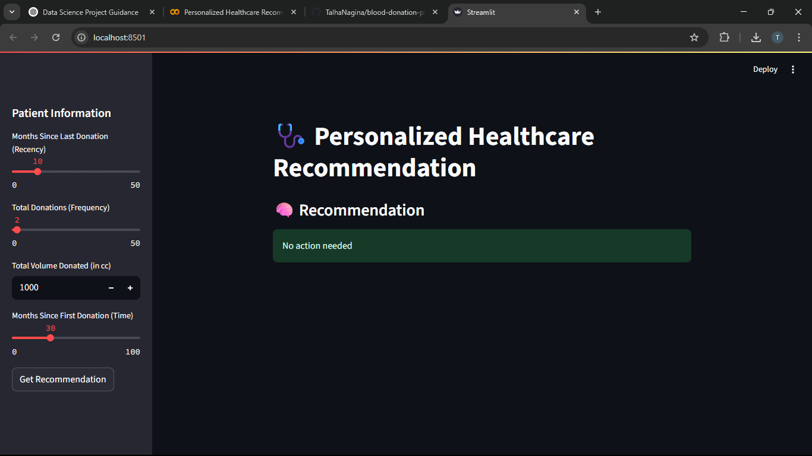

# 🩺 Personalized Healthcare Recommendation System

A machine learning-powered app that analyzes blood donation behavior and recommends personalized healthcare actions — such as regular checkups or lifestyle adjustments.

---

## 🚀 Features

- Predict whether a person is likely to donate blood
- Get real-time health-based recommendations
- Log-transformed & scaled features for optimal modeling
- Trained using Random Forest Classifier
- Streamlit-powered interface for easy interaction

---

## 📁 Project Structure

```
├── app/
│   └── app.py                 # Streamlit app
├── data/
│   └── blood.csv              # Blood donation dataset
├── rf_model.pkl               # Trained Random Forest model
├── scaler.pkl                 # Trained StandardScaler
├── notebooks/                 # Jupyter notebooks (EDA, modeling)
├── requirements.txt
├── README.md
```

---

## 📷 Screenshot  


---

## 🧠 Model Summary

| Feature    | Description                              |
|------------|------------------------------------------|
| Recency    | Months since last donation               |
| Frequency  | Number of past donations                 |
| Monetary   | Total volume donated (log-transformed)   |
| Time       | Months since first donation              |

Target variable: `Class` — whether the user donated in March 2007

---

## 🛠️ How to Run Locally

```bash
pip install -r requirements.txt
streamlit run app/app.py
```

---

## 📌 Future Improvements

- Add BERT or TF-IDF for smarter health notes
- Extend to more classes (e.g. medical urgency levels)
- Connect to real patient databases (FHIR / HL7)
- Deploy live with Streamlit Cloud or Hugging Face Spaces

---

## 📄 License

MIT License © 2025 Talha Nagina
